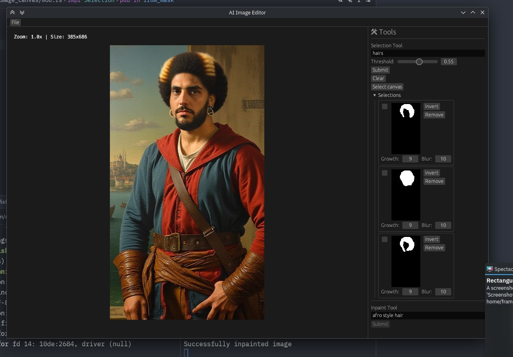

# AIBox Image

An AI-powered image editing desktop application with advanced features like inpainting, face swapping, portrait editing, upscaling, and intelligent selection.



## Overview

AIBox Image is a desktop application built with Rust (frontend) and Python (backend services) that provides a suite of AI-powered image editing tools. The application features a modern GUI built with egui/eframe and leverages state-of-the-art machine learning models for various image manipulation tasks.

## Features

- **Intelligent Selection**: Automated object selection using Grounding DINO and SAM 2 (Segment Anything Model)
- **Inpainting**: Remove or replace objects in images using Stable Diffusion 1.5
- **Face Swapping**: Swap faces between images using InsightFace
- **Portrait Editing**: Advanced portrait manipulation with LivePortrait
- **Image Upscaling**: Enhance image resolution using Stable Diffusion x4 Upscaler
- **History Management**: Track and revert image editing operations
- **Drag & Drop**: Easy image loading via drag and drop

## Architecture

### High-Level Architecture

```
┌─────────────────────────────────────────┐
│          Desktop Application            │
│         (Rust + egui/eframe)            │
│                                         │
│  ┌──────────┐  ┌─────────┐  ┌────────┐│
│  │  Canvas  │  │  Tools  │  │History ││
│  │  Panel   │  │  Panel  │  │ Panel  ││
│  └──────────┘  └─────────┘  └────────┘│
└──────────────────┬──────────────────────┘
                   │ ZeroMQ (msgpack)
                   ├───────────────┬──────────────┬───────────────┐
                   ▼               ▼              ▼               ▼
         ┌──────────────┐  ┌──────────┐  ┌──────────┐  ┌──────────┐
         │  Selection   │  │Inpainting│  │   Face   │  │Upscaling │
         │   Service    │  │ Service  │  │ Swapping │  │ Service  │
         │              │  │          │  │ Service  │  │          │
         │ Grounding    │  │ Stable   │  │Insight-  │  │ Stable   │
         │ DINO + SAM2  │  │Diffusion │  │  Face    │  │Diffusion │
         └──────────────┘  └──────────┘  └──────────┘  └──────────┘
                                  ▲
                                  │
                          ┌───────┴────────┐
                          │   Portrait     │
                          │   Editing      │
                          │   Service      │
                          │                │
                          │  LivePortrait  │
                          └────────────────┘
```

### Components

#### Frontend (Rust)

- **Framework**: eframe 0.32.0 (egui for UI)
- **Image Processing**: image crate with PNG/JPEG support, fast_morphology for image operations
- **Async Runtime**: Tokio for concurrent operations
- **IPC**: ZeroMQ for communication with Python services
- **Serialization**: MessagePack (rmp-serde) for efficient data transfer

**Main Modules**:
- `image_canvas`: Interactive image display and manipulation
- `ai_tools`: UI for all AI-powered editing tools
- `history_panel`: Undo/redo functionality and operation history
- `worker`: Background task management for AI operations
- `config`: Configuration management (reads from config.toml)

#### Backend (Python)

All backend services are built with:
- **PyTorch**: Deep learning framework
- **ZeroMQ**: Message queue for IPC
- **MessagePack**: Binary serialization
- **Pydantic**: Data validation

**Services**:

1. **Selection Service**
   - Models: Grounding DINO + SAM 2
   - Purpose: Intelligent object detection and segmentation

2. **Inpainting Service**
   - Model: Stable Diffusion 1.5 Inpainting
   - Purpose: Remove or replace image regions with AI-generated content

3. **Face Swapping Service**
   - Model: InsightFace + InSwapper
   - Purpose: Detect and swap faces between images

4. **Portrait Editing Service**
   - Model: LivePortrait
   - Purpose: Advanced portrait manipulation and expression transfer

5. **Upscaling Service**
   - Model: Stable Diffusion x4 Upscaler
   - Purpose: Enhance image resolution while preserving quality

#### Shared Library

**aibox-image-lib**: Python package providing common utilities for all services, including:
- Message protocol definitions
- ZeroMQ transport abstractions
- Shared data structures

### Communication Protocol

- **Transport**: ZeroMQ (request-reply pattern)
- **Serialization**: MessagePack for compact binary encoding
- **Data Flow**:
  1. User interacts with Rust frontend
  2. Frontend serializes request (image data + parameters) to MessagePack
  3. Request sent to appropriate Python service via ZeroMQ
  4. Service processes image using AI models
  5. Response (processed image + metadata) sent back via MessagePack
  6. Frontend deserializes and displays result

### Configuration

The application uses a `config.toml` file to manage:
- Model cache directory
- Model selections for each service
- Model-specific parameters (model IDs, checkpoints)

## Technology Stack

### Frontend
- **Language**: Rust (edition 2024)
- **UI Framework**: egui/eframe
- **Image Processing**: image, fast_morphology
- **Async**: Tokio
- **Messaging**: ZeroMQ, MessagePack

### Backend
- **Language**: Python 3.9-3.14
- **ML Framework**: PyTorch
- **Models**: 
  - Hugging Face Transformers (Stable Diffusion models)
  - InsightFace (Face detection/recognition)
  - SAM 2 (Segmentation)
  - Grounding DINO (Object detection)
  - LivePortrait (Portrait editing)
- **Messaging**: PyZMQ, MessagePack
- **Validation**: Pydantic

## Development

### Prerequisites

- Rust (latest stable)
- Python 3.9-3.14
- CUDA-capable GPU (recommended for AI models)
- uv (Python package manager)

### Project Structure

```
aibox-image/
├── app/                          # Rust frontend application
│   ├── src/                      # Source code
│   │   ├── ai_tools/             # AI tool UI components
│   │   ├── image_canvas/         # Canvas implementation
│   │   ├── main.rs               # Application entry point
│   │   └── worker.rs             # Background task handling
│   ├── config.toml               # Application configuration
│   └── Cargo.toml                # Rust dependencies
│
└── backend/                      # Python backend services
    ├── aibox-image-lib/          # Shared Python library
    │   └── src/aibox_image_lib/  # Transport and protocol code
    ├── selection-service/        # Object selection service
    ├── inpainting-service/       # Image inpainting service
    ├── face-swapping-service/    # Face swapping service
    ├── portrait-editing-service/ # Portrait editing service
    └── upscaling-service/        # Image upscaling service
```

### Building

```bash
# Build the frontend
cd app
cargo build --release

# Install backend dependencies (per service)
cd ../backend/selection-service
uv sync
```
